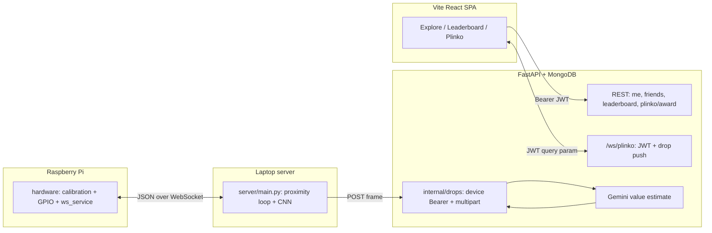

# Trash Recycling Social

A trash-sorting stack that pairs a **Raspberry Pi** (ultrasonic sensing and servo actuation) with a **laptop** (camera + CNN classification), backed by a **React + FastAPI** web app: Auth0 login, friend graph, friend-scoped leaderboards, and a **Plinko** mini-game fed by real bin drops—Gemini estimates value, the backend pushes over WebSocket, and the client renders balls with Matter.js in a macOS-style UI.

## Architecture

The system is four cooperating layers: **physical edge** (Pi), **orchestrator** (laptop `server/`), **cloud API + DB** (`web/backend` + MongoDB), and **SPA** (`web/frontend`). They talk over two different channels: a **device WebSocket** (Pi protocol in `shared/protocol.py`) and **HTTPS** (REST + optional Auth0 JWT WebSocket for Plinko).

**Physical sort loop.** The Pi calibrates ultrasonic baseline, then exposes `get_distance` and `execute_sort` messages. The laptop polls distance; when proximity holds long enough it captures a frame, runs `analysis` (PyTorch CNN), sends the label to the Pi, and retries if the chute still reads “occupied.” After a cycle it may notify a generic HTTP endpoint (`API_BASE_URL`) and posts the JPEG to **`POST /internal/drops`** with a shared **device ingest secret** (not Auth0).

**Backend responsibilities.** FastAPI mounts routers under `/api/*` for authenticated users (JWT from Auth0 JWKS) and `/internal/*` for trusted devices. On drop ingest the API resizes the image, calls **Gemini** for an estimated USD recyclable value, stores a **`drops`** document, and—only if **exactly one** Plinko WebSocket client is connected across all users—pre-inserts a **`point_ledger`** row for that user and pushes a `type: drop` JSON message (including a data-URL image) to that session. Otherwise it skips the WebSocket push (no duplicate awards when zero or many clients are on Plinko).

**Plinko and scoring.** The browser opens `/ws/plinko?token=…` with the same JWT. The client runs **Matter.js** physics; when a ball settles it calls **`POST /api/plinko/award`** with `drop_id` and points. The ledger uses a unique index on `(user_sub, drop_id)` so awards are idempotent. **`/api/leaderboard`** aggregates **`point_ledger`** by `gemini_value` for **accepted friends only** (lifetime or current **week_id**). **`/api/me`** upserts the user profile from token claims and returns **lifetime** point totals from the ledger.

**Simulation.** `simulation/run_scenario.py` starts a **virtual Pi** on localhost that speaks the same laptop-facing protocol; a harness uses extra pin messages the production server must not send. This lets you run the orchestrator and assert JSON scenarios without hardware.

## Repository layout

| Path | Role | Details |
|------|------|---------|
| [`hardware/`](hardware/) | Pi daemon | Calibration, WebSocket server, GPIO (HC-SR04, servos, LED). See [hardware/README.MD](hardware/README.MD). |
| [`server/`](server/) | Laptop orchestrator | Camera, proximity loop, PyTorch `CnnTrash`, `execute_sort` over WebSocket, optional drop image POST to the API. See [server/README.MD](server/README.MD). |
| [`web/`](web/) | Full-stack app | Vite + React + TypeScript frontend and FastAPI + MongoDB backend. See [web/README.MD](web/README.MD). |
| [`web/backend/`](web/backend/) | API service | Auth0 JWTs, Gemini drop valuation, Plinko WebSocket, internal ingest. See [web/backend/README.md](web/backend/README.md). |
| [`model/`](model/) | ML training | YOLO model training (see [model/README.MD](model/README.MD)). |
| [`shared/`](shared/) | Protocol | JSON message types used by Pi and laptop (`protocol.py`). |
| [`simulation/`](simulation/) | Virtual Pi + harness | Same laptop-facing WebSocket protocol as [`hardware/ws_service.py`](hardware/ws_service.py); a **harness** drives simulated distance and LEDs via pin messages while [`server/main.py`](server/main.py) uses the real protocol. [`run_scenario`](simulation/run_scenario.py) starts virtual Pi + server and asserts JSON scenarios. See [simulation/README.md](simulation/README.md). |

## How the pieces connect

1. **Pi** ([`hardware/`](hardware/)) calibrates the ultrasonic baseline, then serves WebSocket commands: `get_distance`, `execute_sort` with a label (`waste` / recyclable / compost). It returns `sort_result` with distance so the laptop can retry if the chute is still occupied.
2. **Laptop** ([`server/`](server/)) connects to the Pi, polls distance, captures a frame when proximity holds, runs the CNN, sends sort commands, and can POST JPEGs to the backend’s internal drop endpoint.
3. **Web** ([`web/`](web/)) stores users, friends, points, and drops; authenticated clients open Plinko and receive **at most one** live `drop` push per ingest when exactly one Plinko session is connected (avoids duplicate awards).
4. **Simulation** ([`simulation/`](simulation/)) runs a **virtual Pi** on `127.0.0.1:18765` (no GPIO). The laptop server uses the same messages as production; only the harness sends `pin_input` / `get_pin_outputs` (the server must not). See [simulation/README.md](simulation/README.md) for headless CNN, `PYTHONPATH`, and scenario JSON.

## End-to-end demo (condensed)

For a fuller checklist (MongoDB, Auth0, env files), follow [web/README.MD](web/README.MD).

1. Run **MongoDB** and configure **`web/backend/.env`** (`MONGODB_URI`, Auth0, `GEMINI_API_KEY`, `DEVICE_INGEST_SECRET`).
2. Start the **backend** from `web/backend/` (`uvicorn main:app --reload --port 8000`).
3. Configure and run **`hardware/main.py`** on the Pi, then **`server/main.py`** on the laptop with `WS_URL` pointing at the Pi. Set `DROP_API_URL` (e.g. `http://localhost:8000/internal/drops`) and align the drop secret with `DEVICE_INGEST_SECRET`.
4. Run **`web/frontend`** (`npm run dev`, default `http://localhost:5173`) with Auth0 SPA settings and optional `VITE_API_BASE_URL` / proxy as in [web/README.MD](web/README.MD).
5. Open **Plinko** in the browser; when the bin completes a sort cycle and posts a drop, Gemini runs on the server and—if a single Plinko client is connected—a ball spawns; when it settles, the client awards points via `POST /api/plinko/award` (idempotent per user and `drop_id`).

## Simulation without hardware

To exercise the laptop **server** against a **virtual Pi** (no physical board), use the flow in [simulation/README.md](simulation/README.md): from the **repository root**, create a venv and install **both** `simulation/requirements.txt` and `server/requirements.txt`, then run `python -m simulation.run_scenario` (optionally `--scenario simulation/scenarios/waste_proximity.json`). `run_scenario` sets `WS_URL=ws://127.0.0.1:18765` for the spawned `server/main.py`. Leave `CNN_MODEL_WEIGHTS_PATH` empty in [`server/config.py`](server/config.py) if you want a headless placeholder label and JPEG without a camera.

## Documentation index

- [Hardware (Pi)](hardware/README.MD) — GPIO, calibration, WebSocket API, run instructions  
- [Server (laptop)](server/README.MD) — config, CNN/camera loop, `api_client` / drop upload  
- [Web app](web/README.MD) — layout, quick start, Auth0 and ingest wiring  
- [FastAPI backend](web/backend/README.md) — env vars, MongoDB collections, notable routes and WebSocket behavior  
- [Model training](model/README.MD) — YOLO training notes  
- [Simulation](simulation/README.md) — virtual GPIO, Pi vs harness protocols, `run_virtual_pi` / `run_scenario`, scenario JSON expectations  
